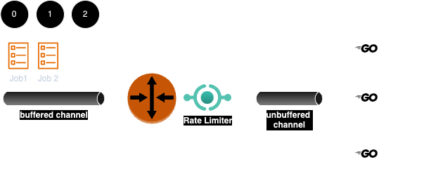
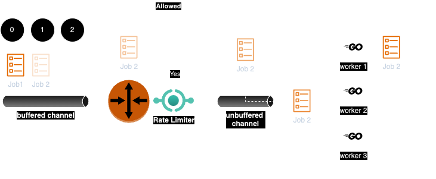
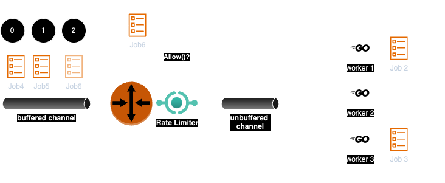
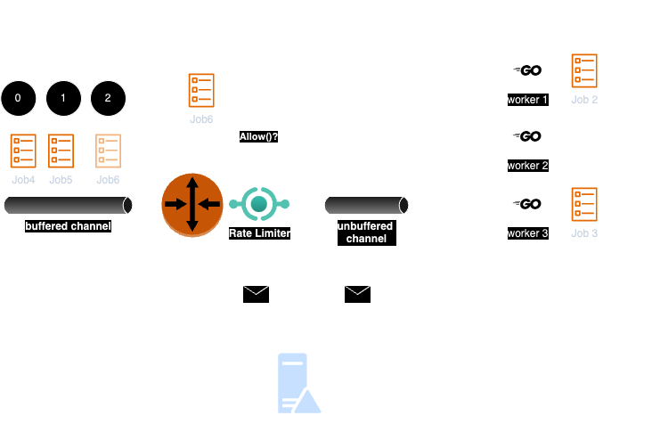

 
 **DISCLAIMER: GERAS STILL IN BETA. VERSION TAG COMING 12/1/2023** 
 
 <div align="center">
 
</div>

 ### Geras ### 

The **geras** package provides a flexible and efficient buffered job queue for processing and managing tasks concurrently. It offers a way to add, start, stop, and monitor the progress of jobs. This README will provide an overview of the package, its functionality, and best practices for using it effectively.

## Why use Geras? ## 

Quick questions to see if Geras is a potential fit for you: 
- Are you building a service using Go? 
- Do you need a buffer and orchestrator for requests within your service?
- Are you handling tasks that are real time or batch? 
- Would concurrency and parallelism enhance your service's performance?

If you answered yes to any of these questions, **geras** can help simplify development & enhance performance of your service. 
 
 ## Table of Contents
 1. [Introduction](#introduction)
 2. [How it Works](#how-it-works)
    - [Add Job to Geras](#add-job-to-Geras)
    - [Start Dispatch Loop](#start-dispatch-loop)
    - [Control Messages and Event](#control-messages-and-events)
 3. [Use Cases](#use-cases)
 4. [Installation](#installation)
 5. [Usage](#usage)
    - [Creating Geras](#creating-a-Geras)
    - [Creating a Job](#creating-a-job)
    - [Adding Jobs](#adding-jobs)
    - [Starting and Stopping](#starting-and-stopping)
    - [Monitoring Queue Length & Capacity](#monitoring-queue-length-&-capacity)
    - [Getting Job Stats](#getting-job-stats)
    - [Job Stats](#job-stats)
    - [Error Handling](#error-handling)
 6. [Contributing](#contributing)
 7. [License](#license)
 
 ## Introduction

  The **geras** package provides a buffered queue for handling jobs concurrently. It is designed for use cases where you want to process a large number of tasks efficiently, batch and in real time. **geras** offers the following key features:

 - **Concurrency & parrallel processing**: Jobs added to the queue are processed asynchronously using a dispatcher and a go routine workerpool.   
 - **Rate limiting**: You can configure the rate at which jobs are processed which allows you to control backpressure to system you're integrating with.
 - **Custom Error Handling**: You can implement the error handler interface and control how failed job are processed.  

 ## How it Works

 

At a high level, Geras uses 4 main interfaces, job, dispatcher, ledger and controller.  

The [job](./pkg/geras/job.go) interface is the job that is being processed.  You can implement any logic required, as you satisfy the interface methods.

The [dispatcher](./pkg/geras/dispatcher.go) dispatches jobs based on rate limit configuration.  

The [ledger](./pkg/geras/ledger.go) maintains all the job execution data and metrics.  

The [controller](./internal/controller/controller.go) manages all the components, keeps track of all events and control how geras responds to events like initialization and shutdown.  

### Add Job to Geras ### 
When you add a job to Geras, it's placed into a buffered channel monitored by the dispatcher. This keeps clients decoupled from the job execution. 
 

### Start Dispatch Loop ###
When Geras starts the dispatch loop, it allows the dispatcher to receive jobs from the buffered job channel and dispatch them to an unbuffered channel that the worker pool listens on.  

 

The dispatcher uses a fixed window rate limiter, which helps you stay within a specified rate limit that you can configure. This rate limiter ensures that you can control backpressure to you backend system.

 

Workers run in an infinite loop processing jobs concurrently from the unbuffered channel.  They will exit only if signaled by the controller for various control events such as init or shutdown.  

### Control Messages and Events ###
Geras uses a centralized controller to send control messages and receive control event.  **Control messages** are actions such as init, finalize etc., that the controller wants component(s) to perform.  **Control events** are the way components communicate important events to the controller such as a worker coming online or the dispatcher shutting down.  

 


 ## Use Cases
Geras can be used for various distributed system use cases : 
 
**Managing hosted infrastructure** - As a service provider, working with customer apps that are deployed on serverless or platform services such as AWS Lambda, Fargate, Kubernetes etc is a great use case.  Performing regular upgrades / patches, responding to CVE's, setting up tenant infrastructure etc. could be safely processed using Geras.  The rate limiting allows you to ensure your service doesn't overconsume api quota and cause throttling. 

**Real time or batch processing** - Any time you need an orchestrator to process jobs in real time or in batch is a great use case for geras.  Geras is an open orchestrator so as long as you implement the `Job` interface, geras will work. 
 
 ## Installation
 
 To use **Geras** package in your Go project, you can install it via Go modules:
 
  
 ```bash
 go get github.com/outofoffice3/geras-sandbox-pro/geras
 ```
 
 ## Usage
 
 ### Creating Geras

 To get started with the **Geras** package, you need to create a Geras instance. The following code demonstrates how to create a Geras:
 
 ```go
 import (
     "context"
     "github.com/outofoffice3/geras-sandbox-pro/geras"
 )

 func main() {
    // Create a context with a cancel function
     ctx, cancel := context.WithCancel(context.Background())
     defer cancel() // Ensure the context is canceled when done
 
     // Define the Geras configuration
    config := geras.NewGerasInput{
        NumWorkers:     3,   // Number of worker goroutines
        QueueSize:      100, // Size of the job queue
        RateLimit:      10,  // Maximum transactions allowed
        RateTimeWindow: 1,  // Time window for rate limiting (seconds)
     }
 
     // Create a new Geras instance
     geras, err := geras.NewGeras(config)
     if err != nil {
         // Handle the error
     }
 
     // You can now use the Geras instance for job processing.
 }
```

### Creating a Job

To use the Geras package, you'll need to create jobs that implement the [Job](./pkg/geras/job.go) interface. The [Job](./pkg/geras/job.go) interface defines methods that allow geras to interact with your custom job.

Here's how to create a job that implements the [Job](./pkg/geras/job.go) interface:

```go
package main

import (
    "github.com/outofoffice3/geras-sandbox-pro/geras"
)

// MyJob is an example job that implements the Job interface.
type MyJob struct {
    jobName string
    jobID   string
    // Add any other fields specific to your job.
}

// Do method implements the logic for executing the job.
func (mj *MyJob) Do() error {
    // Implement the job logic here.
    // Return an error if the job fails; otherwise, return nil.
    return nil
}

// SetJobName sets the name of the job.
func (mj *MyJob) SetJobName(name string) {
    mj.jobName = name
}

// GetJobName returns the name of the job.
func (mj *MyJob) GetJobName() string {
    return mj.jobName
}

// SetJobId sets the job ID.
func (mj *MyJob) SetJobId(id string) error {
    mj.jobID = id
    return nil
}

// GetJobId returns the job ID.
func (mj *MyJob) GetJobId() string {
    return mj.jobID
}

func main() {
    // will show how to add jobs to Geras in next section
}
```
 
 ### Adding Jobs

 Jobs can be added to the Geras instance using the `Add(job)` method. You can define your job by implementing the `Job` interface.
 
 ```go
 func main() {
     // Create a Geras instance (as shown in the previous section)
 
     // Initialize your job
     myJob := &MyJob{}
 
     // Add the job to the Geras
    err := geras.AddJob(myJob)
     if err != nil {
             // Handle the error
     }
 }
 ```

### Starting and Stopping

Before processing jobs, you should start the Geras by calling the `Start()` method. This initializes the job processing. 

```go 
err := geras.Start()
if err != nil {
    // Handle the error
}
```
To stop Geras, call the `Stop()` method. This will wait for all jobs to complete and gracefully shut down. 

```go
err := geras.Stop()
if err != nil {
    // Handle the error
}
```

### Getting Job Stats 
Geras will expose the following metrics to user via its `GetJobStats()` interface method: 

**Expected Overhead Metrics** 
- `totalDurationThrottledByRateLimiter` - total duration the job had to wait until rate limiter allowed request

**Unexpected Ovearhead Metrics** 
- `totalDurationPendingInQueue` - total duration a job was sitting in the buffered queue waiting to be picked up by dispatcher
- `totalDurationWaitingToDispatch` - total duration the job was waiting to be dispatched (workers were busy)

**Job Execution Metrics**
- `jobExecutionDuration` - duration to execute the business logic of the job
- `totalJobDuration` - total duration of all steps
- `totalExpectedJobOverheadDuration` - total duration of expected job overhead 
- `totalUnexpectedJobOverheadDuration` - total duration of unexpected job overhead 
- `totalJobOverheadDuration` - total duration of job overhead  

### Monitoring Queue Length & Capacity

You can monitor the length and capacity of the job queue using the `Len()` and `Cap()` methods. 

```go 
length := geras.Len()  // Get the current length of the job queue
capacity := geras.Cap()  // Get the capacity of the job queue
```

### Job Stats ### 

You can get the following job stats from the Geras interface: 
```go 
totalFailedJobs := geras.GetFailedJobsCount() // int32
totalWorkers := geras.GetTotalWorkerCount() // int32
totalJobsDispatched := geras.GetTotalJobsDispatched() // int32
totaJobsThrottled := geras.GetTotalJobsThrottled() // int32
```

### Error Handling

You can set an error handler to deal with failed jobs by calling the `SetErrorHandler(func(error))` method. 

```go 
geras.SetErrorHandler(func(err error) {
    // Handle the error here
})
```

## License

This package is distributed under the Apache 2.0 License. See the [NOTICE](./NOTICE) and [LICENSE](./LICENSE) file for more information.

## Contributing

Feel free to open issues and pull requests. We welcome your contributions!

